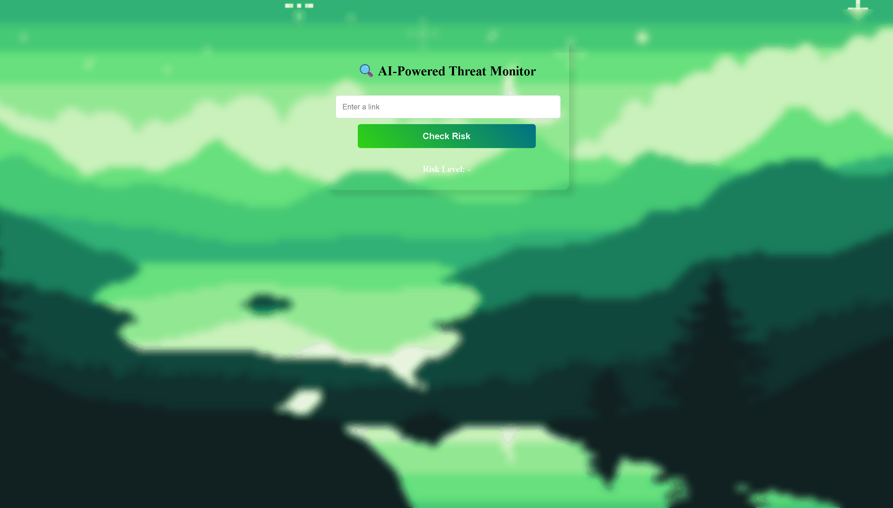

# Shield X - AI-Powered Threat Monitor

## Overview

**Shield X** is a web-based application developed for a college hackathon event. It leverages the Google Safe Browsing API to analyze and detect the risk level of any URL, helping users stay safe from malicious, suspicious, or phishing links. The project features a simple and intuitive interface, making it easy for anyone to check the safety of a link before clicking.

---

## Features

- **Real-Time URL Risk Analysis:** Instantly checks if a URL is safe, suspicious, or dangerous.
- **Google Safe Browsing Integration:** Uses a trusted threat intelligence API for accurate results.
- **User-Friendly Interface:** Clean and responsive design for quick and easy use.
- **Visual Risk Indicators:** Color-coded badges for risk levels (green for safe, orange for suspicious, red for dangerous).
- **Hackathon Ready:** Lightweight, fast, and easy to deploy.

---

## How It Works

1. **User Input:** Enter any URL in the input box.
2. **Risk Check:** Click the "Check Risk" button.
3. **Result Display:** The app shows a "Checking..." message, then displays the risk level after a short delay.

---

## Tech Stack

- **Frontend:** HTML, CSS, JavaScript
- **Backend:** Python, FastAPI
- **Threat Intelligence:** Google Safe Browsing API

---


## File Structure

```
.
├── backend.py      # FastAPI backend for URL risk checking
├── index.html      # Main frontend HTML file
├── script.js       # Frontend JavaScript logic
├── style.css       # Styling for the frontend
└── README.md       # Project documentation
```

---

## Demo



---

## Team

- Veeraarun V
- Vettrivelan G
- Ammu Krishnaprasad
- Roshni A

---

## License

This project is for educational and hackathon use only.

---

## Acknowledgements

- [Google Safe Browsing API](https://developers.google.com/safe-browsing/)
- [FastAPI](https://fastapi.tiangolo.com/)
- [Sri Shakthi University, Coimbatore] Hackathon Organizers

---

**Stay safe online**